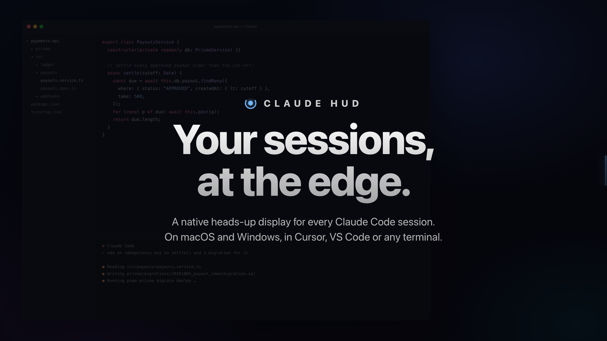
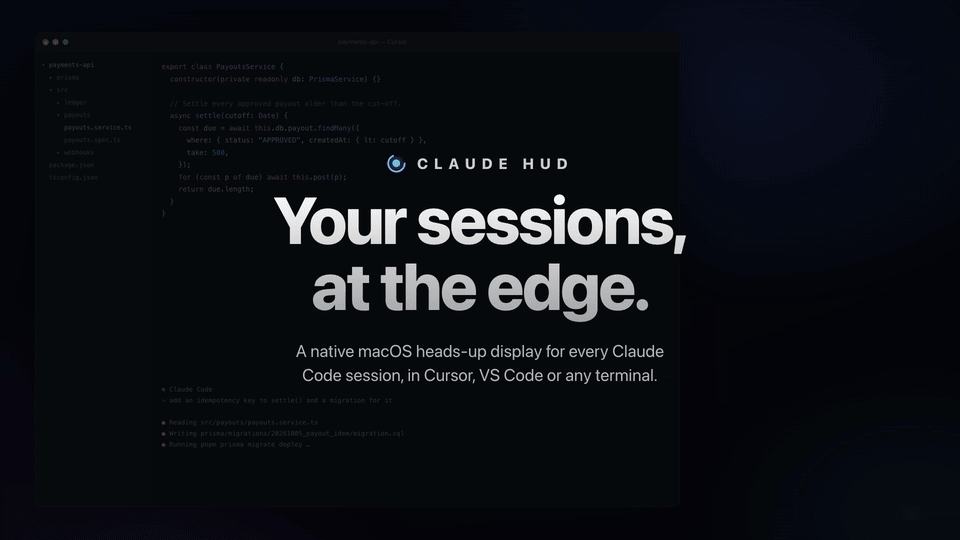
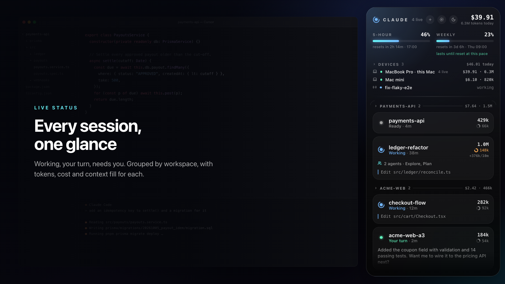
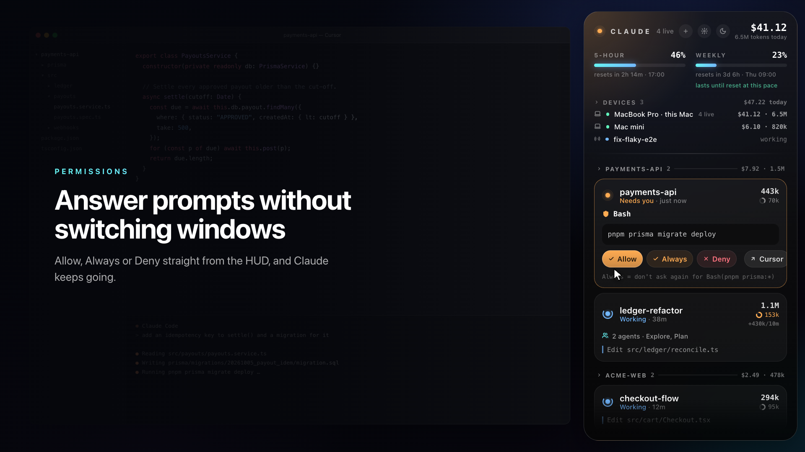
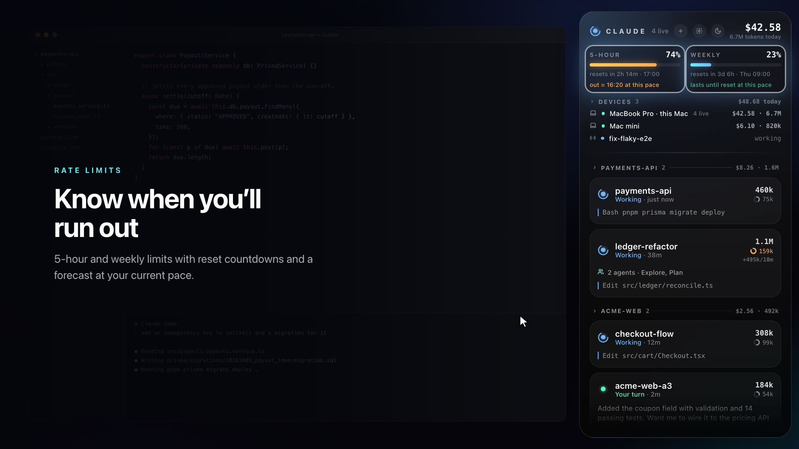
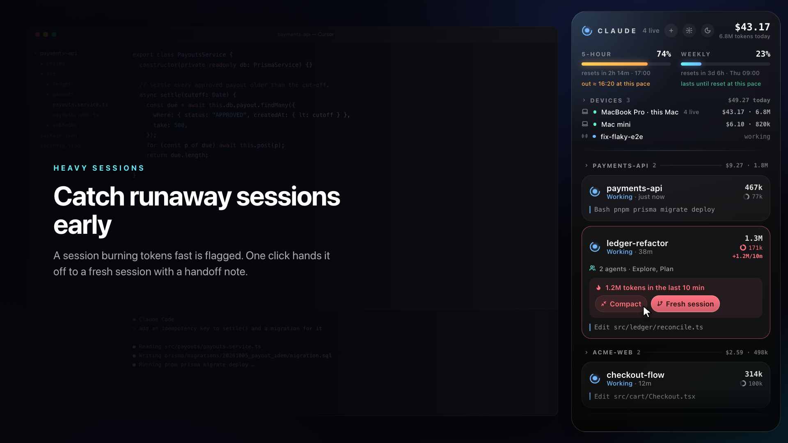
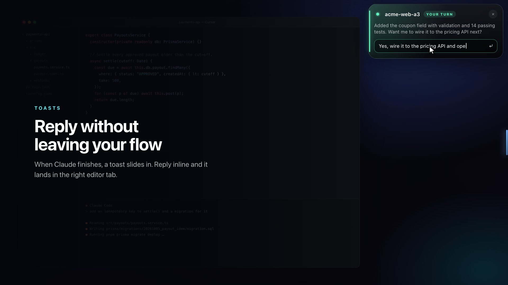

<p align="center"></p>

# Claude HUD

A native macOS heads-up display for every [Claude Code](https://claude.com/claude-code) session you run. It sits at the edge of your screen and shows what each session is doing, what it has cost, how close you are to your limits, and which session needs you next. You can answer from the HUD without switching windows.

<p align="center"></p>

▶ **[Watch the 30-second video](docs/claude-hud.mp4)**

## What it does

| | |
|---|---|
|  | **Every session at a glance.** Sessions are sorted by what needs you first (*Needs you* → *Your turn* → *Working*) and grouped by workspace. Each one shows its tokens, cost at API prices, context fill and live subagents. |
|  | **Answer permission prompts from the HUD.** Choose Allow, Always or Deny and Claude carries on. You can also pass the prompt back to your editor. |
|  | **Rate limits with a forecast.** The 5-hour and weekly bars show reset countdowns and estimate when you'll run out at your current pace. Usage spent elsewhere (claude.ai, your phone, another Mac) is detected too. |
|  | **Catch runaway sessions.** A session burning tokens fast gets flagged. *Fresh session* starts a new one in the same workspace with a handoff note built from the old transcript. That costs no tokens. |
|  | **Toasts you can reply to.** When Claude finishes, a toast slides in. Type a reply and it lands in that session's tab. |

Also included:

- **Save-tokens tips** based on your own transcripts. You get the top three by tokens at stake, each with a one-click fix:
  - a large context that is re-sent with every message → *Compact*
  - a cache that expired during breaks, so the session paid full price again → compact before stepping away
  - Opus or Fable used for heavy routine work → *Use Sonnet*, showing what share it would save
  - subagents eating most of the day
  - a 5-hour limit you'll hit at your current pace
- A global hotkey and full keyboard control (`↑↓ ↩ A D R /`)
- Search across sessions
- Do Not Disturb, plus automatic quiet during Zoom meetings
- A menu-bar item, idle reminders, and four themes
- Multi-Mac totals through iCloud Drive, with a list of your remote and claude.ai/code sessions

It is light on resources: one Swift file, no dependencies, and about 1.5% CPU while idle.

## Works in any IDE or terminal

| | Status, toasts, costs, limits, permission answers | Open | Reply / Compact / Fresh session |
|---|---|---|---|
| **Cursor, VS Code, VS Code Insiders** | ✅ | ✅ exact chat tab | ✅ typed into the tab for you |
| **Terminal, iTerm, Ghostty, JetBrains, Zed, …** | ✅ | ✅ brings that app forward | ✅ copied to the clipboard, ⌘V to paste |

The HUD is driven by Claude Code hooks, so monitoring works wherever Claude Code runs. For each session it finds the app that hosts it by walking up from the `claude` process. Cursor and VS Code get the Claude Code extension's deep link (`…://anthropic.claude-code/open`), which picks the exact tab. Every other app is focused, and any text goes to the clipboard rather than being typed into a window the HUD can't see.

## Install

Requires macOS 14+, the Xcode command-line tools (`xcode-select --install`) and `jq` (`brew install jq`).

```sh
git clone https://github.com/Louayzouaoui1/claude-hud && cd claude-hud && ./install.sh
```

`install.sh` does the following:

1. Compiles `main.swift` into `~/Applications/ClaudeHUD.app`.
2. Copies three small hook scripts to `~/.claude/hud/`.
3. Adds Claude HUD hooks and a status line to `~/.claude/settings.json`. A backup is saved as `settings.json.bak-claudehud`. Your other hooks are left untouched, and an existing status line is kept.
4. Starts the app and adds it as a login item.

It's safe to re-run. Grant **Accessibility** when asked: the HUD needs it to land in the right editor window and to auto-send handoffs. Set `CODESIGN_ID` to your own signing identity if you want that permission to survive rebuilds.

## How it works

```
Claude Code ──hooks──▶ ~/.claude/hud/events.jsonl ──▶ Claude HUD (SwiftUI panel)
            ──PermissionRequest──▶ req/<id>.json ◀── answer ── ans/<id>
            ──statusline──▶ limits.json (5-hour / weekly)
transcripts (~/.claude/projects) ──▶ token + cost counting
```

## Privacy

Everything stays on your Mac. There's no server and no telemetry. To show live limits and your remote sessions, the HUD reads your existing Claude Code login from the Keychain and calls the same Anthropic endpoints that Claude Code uses. Those endpoints aren't a public API, so they may change. Turning on device sync writes only daily token and cost totals to your own iCloud Drive.

## Uninstall

```sh
pkill -x ClaudeHUD; rm -rf ~/Applications/ClaudeHUD.app ~/.claude/hud
cp ~/.claude/settings.json.bak-claudehud ~/.claude/settings.json   # or remove the claude/hud hook entries by hand
```

---

Claude HUD is an independent project and isn't affiliated with or endorsed by Anthropic. "Claude" is a trademark of Anthropic. Costs are shown at API list prices for comparison only; subscription plans aren't billed this way.

MIT License
